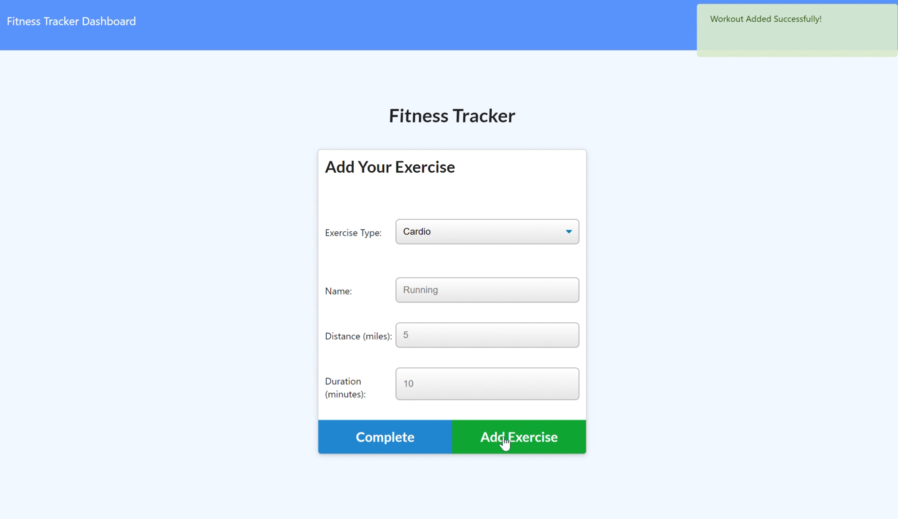
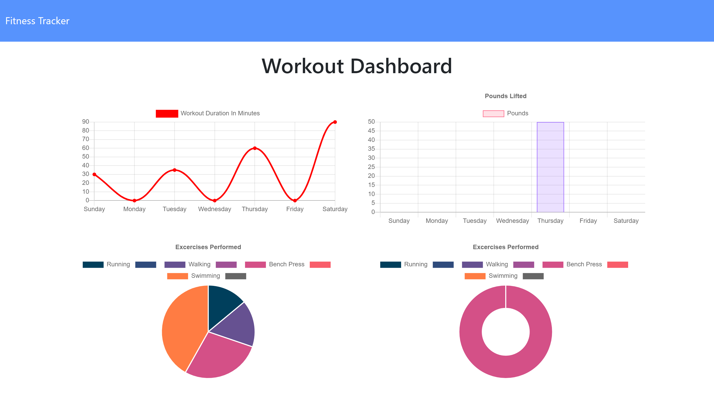
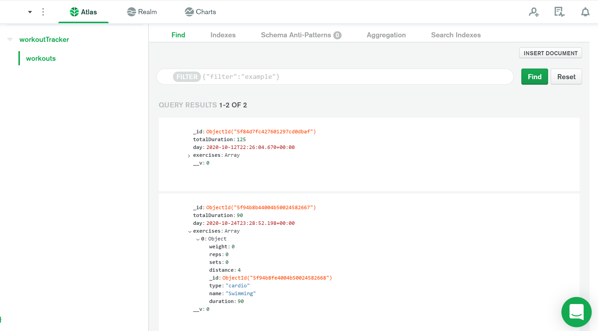
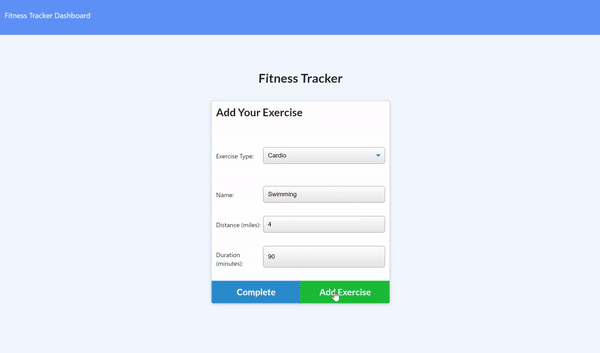

# T_0202Fit

## Preview

User is able to successfully track their workout progess!

## Table of contents

- [General info](#general-info)
- [Technologies](#Technologies)
- [Summary](#Summary)
- [Usage](#Usage)
- [Expectations](#Expectations)
- [Author](#Author)
- [License](#License)

## General info

Deployed Heroku app using MongoDB. 

## Technologies
- [HTML]
- [CSS]
- [JavaScript](https://www.javascript.com/)
- [Node.js](https://nodejs.org/)
- [MongoDB](https://www.mongodb.com/cloud/atlas/lp/try2?utm_source=google&utm_campaign=gs_footprint_row_search_brand_phrase_intent_test_atlas_desktop&utm_term=mongodb&utm_medium=cpc_paid_search&utm_ad=p&utm_ad_campaign_id=11295578158&gclid=CjwKCAjwoc_8BRAcEiwAzJevtcHPwdROYxuhEfiqyYVANZk0H0bWLs0n-F_q_-S7PGeIpxGyRSOZMBoCZ4QQAvD_BwE)
- [Heroku](https://id.heroku.com/login)
- [package.json](https://docs.npmjs.com/creating-a-package-json-file)
- [npm](https://www.npmjs.com/)
## Summary
Fitness tracker to track any workouts you do throughout the day and data is stored in MongoDB. 

## Usage
- `$ npm install`
- `$ npm install --save-dev nodemon`
- `$ npm start`
- go to brower and run `localhost:3000`
- `Ctrl+C` stop running locally 

## Expectations

Link to Heroku App : https://immense-refuge-82476.herokuapp.com/?id=5f94b8b44004b50024582667

## Author

Cheyenne Hunt

## License

Open Source